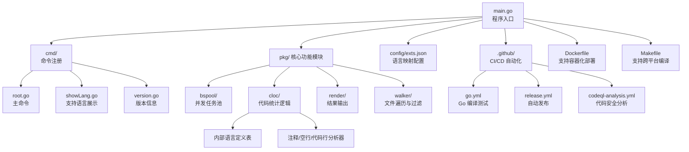

# gcloc: Source Code Line Counter

**[中文](./README.zh.md)** | **English**

**gcloc** is an open-source tool designed to count source code files and lines in various programming languages. It supports a wide range of languages and is easily extendable to include custom languages. Simple and easy to use, gcloc helps developers quickly understand their codebase and track changes over time.

---

## Acknowledgment

This project builds upon the foundational work of [hhatto's gocloc](https://github.com/hhatto/gocloc). We sincerely thank the original author for their contributions to the open-source community, which provided the basis for gcloc's further development.

---



---

## Features
- **Language Support**: Counts files, blank lines, comment lines, and code lines for multiple programming languages.
- **Customizable**: Add support for more languages as needed.
- **High Performance**: Utilizes concurrency for efficient file retrieval and analysis, making it fast even for large codebases.
- **Output Formats**: Supports multiple output formats, including default table view, XML, JSON, and Sloccount format.
- **Filters**: Include or exclude files and directories based on extensions, regex patterns, or specific languages.
- **Detailed Statistics**: Optionally report results for each source file.

---

## Future Development

- [X] Support for Git Repositories

  - Analyze Git repositories directly without specifying a directory.
  - Display statistics for the entire repository, including commit history.

- [X] Web Interface

  - Create a web interface for gcloc to provide a user-friendly experience.
  - Allow users to upload files or directories for analysis.

- [ ] Support for Archive Files

  - Analyze compressed files (e.g., .zip, .tar.gz) without manual extraction.
  - Extract and analyze files on-the-fly to provide accurate statistics.

---

## Installation

```bash
go install github.com/Scorpio69t/gcloc/app/gcloc@latest
```


Alternatively, download the precompiled binary from the [Releases](https://github.com/Scorpio69t/gcloc/releases) page.

---

## Usage

```bash
gcloc [flags] PATH...
gcloc [command]
```

### Example

Analyze the current directory:

```bash
gcloc .
```

**Sample Output**:
```
$gcloc .
github.com/Scorpio69t/gcloc T=0.03 s (7318.7 files/s 2219353.8 lines/s)
-------------------------------------------------------------------------------
Language                     files          blank        comment           code
-------------------------------------------------------------------------------
C++ Header                       8           9494           3756          37956
C++                             28           3137           1752          13517
JSON                            43              1              0           9368
...
Total                          249          14710           7060          75508
-------------------------------------------------------------------------------
```

### Commands
#### General Commands
- `completion`: Generate the autocompletion script for your shell.
- `help`: Display help information for a command.
- `show-lang`: List all supported languages and their extensions.
- `version`: Print the version number of gcloc.

#### Flags
| Flag                | Description                                                                                |
|---------------------|--------------------------------------------------------------------------------------------|
| `--by-file`         | Report results for every encountered source file.                                          |
| `--debug`           | Dump debug log for developers.                                                             |
| `--exclude-ext`     | Exclude file name extensions (comma-separated).                                            |
| `--exclude-lang`    | Exclude specific languages (comma-separated).                                              |
| `--include-lang`    | Include specific languages (comma-separated).                                              |
| `--match`           | Include files matching a regex pattern.                                                    |
| `--not-match`       | Exclude files matching a regex pattern.                                                    |
| `--match-d`         | Include directories matching a regex pattern.                                              |
| `--not-match-d`     | Exclude directories matching a regex pattern.                                              |
| `--output-type`     | Choose an output format: `default`, `gcloc-xml`, `sloccount`, `json` (default: `default`). |
| `--skip-duplicated` | Skip duplicated files.                                                                     |
| `--sort`            | Sort results by `name`, `files`, `blanks`, `comments`, or `codes` (default: `codes`).      |

---

## Examples

### Analyze Specific Directory
```bash
gcloc /path/to/code
```

### Include Only Specific Languages
```bash
gcloc --include-lang "C++,JSON" .
```

### Exclude Files by Extension
```bash
gcloc --exclude-ext "json,xml" .
```

### Generate JSON Output
```bash
gcloc --output-type json .
```

### Show Supported Languages
```bash
gcloc show-lang
```
### Start a web server
```bash
gcloc web
```

---

## Contribution

Contributions are welcome! To contribute:
1. Fork the repository.
2. Create a new branch for your feature or bug fix.
3. Submit a pull request with detailed explanations.

---

## License

This project is licensed under the [MIT License](https://github.com/Scorpio69t/gcloc/blob/main/LICENSE).

---

## Acknowledgments

Special thanks to all contributors who helped make gcloc a robust and reliable tool for source code analysis.
